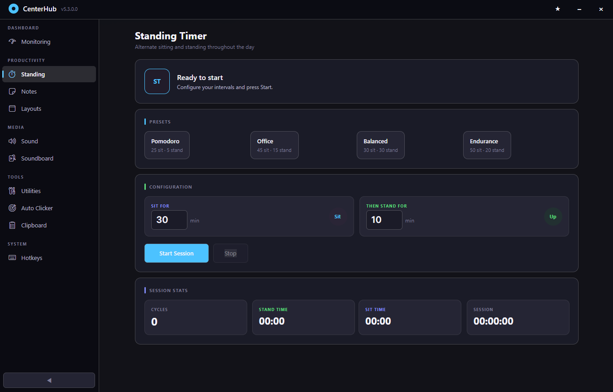
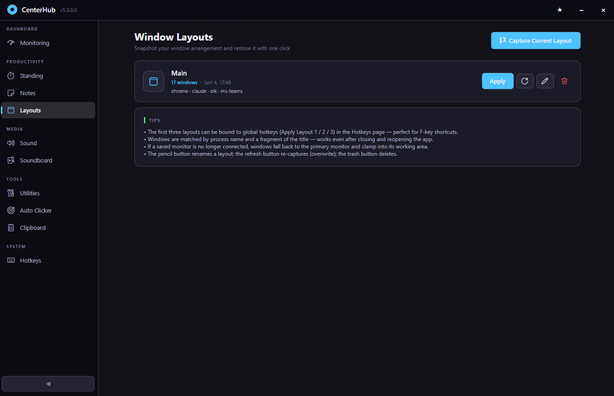
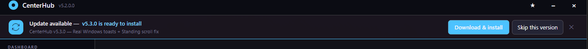

# CenterHub

> A modern Windows 11 productivity hub — system monitoring, audio control, soundboard, clipboard history, standing-timer, auto-clicker, **window-layout snapshots**, hotkeys, and developer tools — wrapped in a Fluent / Mica UI with a built-in **auto-updater**.

Built with **Avalonia UI 11** on **.NET 10 LTS**.

<!-- Hero shot — the dashboard with the Fluent/Mica look at full window size -->


---

## ✨ Features

### 📊 System Monitoring

| | |
|---|---|
| Live CPU / GPU / RAM percentages with **temperature badges** (now + max) | Color-coded per metric (blue / violet / emerald / amber) |
| **Storage tiles** for every fixed drive — used / total + fill bar | Updates every 2 seconds via [LibreHardwareMonitor](https://github.com/LibreHardwareMonitor/LibreHardwareMonitor) |
| **Compact Favorites panel** (always-on-top, 380×640) | Per-tile DWM-aware borders that don't bleed |


---

### 🔊 Sound

- **Three switchable audio profiles** — device + master volume per profile, applied with one click or a global hotkey
- **Quick-controls strip** — output device, master volume slider, mic mute toggle, default playback/communication device pickers
- **Advanced Sound Controls** window — per-app volume mixer (like SndVol but Fluent-themed)
- **Compact Favorites panel** for secondary monitors (Corsair Edge / pen-display friendly)


---

### 🎵 Soundboard

- Browse-add or drag-drop audio clips into a **tile grid**
- Per-clip volume + remove control
- **Output to any audio device** (route to Voicemeeter Input for Discord setups)
- Optional **monitor mix** — hear yourself
- **Discord setup wizard** built in with step-by-step Voicemeeter routing
- Bindable global hotkeys for "Play sound 1 / 2 / 3" and "Stop playback"

---

### 🧘 Standing Timer

- Live **MM:SS countdown** in the hero panel (92 px digits, readable from across the room)
- **Phase progress bar** + "next switch at HH:MM" + session stats (cycles, total stand time, total sit time)
- **4 presets** — Pomodoro (25/5), Office (45/15), Balanced (30/30), Endurance (50/20)
- **Skip-phase** command if you want to flip early
- **Real Windows toast notifications** (v5.3.0+) — phase transitions raise an Action Center notification with `Reminder` priority. **Breaks through Focus Assist and Game Mode** so you actually see them while gaming. Same-group tagging means a "Sit down" toast replaces an in-flight "Stand up" toast instead of stacking up while you're AFK.



---

### 🪟 Window Layouts <sup>v5.2.0</sup>

Snapshot every visible window's position, size, monitor and minimize/maximize state into a named layout. Restore the whole arrangement with one click or a hotkey.

- **Capture Current Layout** → name it ("Work", "Meeting", "Gaming") → done
- **Apply** → windows snap back to their saved positions, including the correct monitor
- **Recapture** to overwrite a layout with the current arrangement
- **Three hotkey slots** — Apply Layout 1 / 2 / 3 — bindable in the Hotkeys page. Suggested F9 / F10 / F11.

The hard part — multi-monitor + DWM border compensation — is handled correctly:

1. Capture uses `DwmGetWindowAttribute(DWMWA_EXTENDED_FRAME_BOUNDS)` for the user-*visible* rect, not `GetWindowRect`/`WINDOWPLACEMENT` (which both miss the ~7 px invisible shadow border Win10/11 adds for rounded corners).
2. Apply does `restore → SetWindowPos → re-state`: the window lands on the right monitor before `ShowWindow(SW_SHOWMAXIMIZED)` maximizes it on that display.
3. **Off-monitor fallback** — if a saved monitor is gone (external display unplugged), the window clamps into the primary monitor's working area. Never lands off-screen.

Persisted at `%LOCALAPPDATA%\CenterHub\layouts.json`.

<!-- Drop a screenshot of the Layouts page at docs/screenshots/window-layouts.png to enable -->


---

### 🖱 Auto Clicker

Doesn't fight your cursor. Three modes:

| Mode | Behavior | Use case |
|---|---|---|
| **Silent (default)** | `PostMessage(WM_LBUTTONDOWN/UP)` to the window under the target — cursor never moves | 90% of cases. Web pages, productivity apps |
| **Teleport** | Old behavior — `SetCursorPos` + real `SendInput` click | Games / DirectInput apps that ignore synthetic messages |
| **Follow** | Clicks wherever the cursor currently is | Free-roam clicking with manual aim |

- **Arm countdown** (default 3 s) with a big yellow "ARMING — 3s" panel before the first click
- **Failsafe corner-abort** — slam the mouse to the top-left corner to instantly stop (PyAutoGUI pattern)
- **Click limit** (0 = ∞), **L/R/M button picker**, **±N px jitter**
- Live click counter + elapsed clock
- Sub-second intervals allowed (`0,05` = 50 ms / 20 cps) — accepts both `.` and `,` decimal separators


---

### 📋 Clipboard History

- Toggleable capture (on by default; bindable to a global hotkey)
- **Pin** entries to keep them across clears
- One-click **Copy back** + delete per entry
- Compact list with timestamps + character counts

---

### 📝 Quick Notes

- List view + editor pane (Notion-style)
- Auto-save with "Last saved" timestamp
- Export to text file

---

### 🛠 Developer Tools (Utilities)

| Tool | Notes |
|---|---|
| **JSON stringify / unstringify** | Roundtrips escaped JSON strings |
| **Base64 encode / decode** | Standard alphabet |
| **URL encode / decode** | `application/x-www-form-urlencoded` |
| **Hash generator** | MD5, SHA-256, SHA-512 |
| **Unix timestamp ↔ date** | Local and UTC |
| **GUID generator** | Standard, UPPERCASE, no-dashes |


---

### ⌨ Global Hotkeys

Bind any system-wide keyboard shortcut to any of these actions:

- **App** — Show / Hide window
- **Audio** — Mute mic, Next sound profile, Previous sound profile
- **Auto Clicker** — Start/Stop, Capture position
- **Clipboard** — Toggle monitoring
- **Soundboard** — Play sound 1 / 2 / 3, Stop playback
- **Standing Timer** — Start/Stop
- **Window Layouts** <sup>v5.2.0</sup> — Apply Layout 1 / 2 / 3

Conflicts are detected at bind time — if a combo's taken by another app, you'll see a warning before the binding is committed.


---

### 🔔 Auto-Updates <sup>v5.2.0</sup>

CenterHub checks for new releases automatically — no manual changelog-watching required.

- **10 seconds after launch**, a background task polls the GitHub Releases API
- If a newer version is available (and you haven't skipped it), a **sky-blue banner** slides in under the title bar
- **One-click upgrade** — Download & install fetches the `.msi`, runs `msiexec /passive`, and CenterHub gracefully shuts down for the upgrade to complete
- **Skip this version** — won't notify again until the *next* release (per-tag, persisted)
- **Dismiss** (×) — hides for this session only

The banner shows the new version number plus a one-line excerpt from the release notes so you know what's coming before you click install.

> 🔒 GitHub Releases is the single source of truth. Pre-releases and drafts are ignored — only releases tagged as **Latest** trigger the banner. Cached for 6 hours to stay well under GitHub's anonymous API rate limit. No telemetry.

<!-- Drop a screenshot of the update banner at docs/screenshots/update-banner.png to enable -->


---

## 🪟 Design language — Fluent / Mica

- **Mica backdrop** — the desktop wallpaper subtly tints the window chrome on Windows 11
- **Acrylic fallback** for Windows 10 1903+
- **Segoe Fluent Icons** in the sidebar (Speed gauge for Monitoring, Stopwatch for Standing, Volume for Sound, etc.) — the same icon font Windows Settings and File Explorer use
- **Segoe UI Variable Display** for large metric numbers, **Segoe UI Variable Text** for body
- Hairline borders (alpha-channel), 12 px card corners, 6 px button corners
- 120 ms `BrushTransition` hover so buttons feel responsive without flicker
- Win11-red close button hover (`#E81123`), Win11-default sky-blue accent (`#4CC2FF`)
- High-alpha card surfaces (~91 %) so cards stay readable but the Mica still bleeds through subtly

---

## 📦 Install

### MSI installer (recommended)

Download **`CenterHub.msi`** from the [latest release](https://github.com/MikWil/CenterHubPC/releases/latest) and run it. Code-signed, installs to `%LOCALAPPDATA%\CenterHub`, creates Start-Menu + Desktop shortcuts, **no admin needed**. Upgrading from an earlier version is automatic — MSI MajorUpgrade removes the old install first.

If you're already running CenterHub, the **in-app update banner** will tell you about new releases ~10 seconds after launch — click **Download & install** for a one-click upgrade.

### Portable

Grab `CenterHub-vX.Y.Z-Portable.zip`, extract anywhere, run `CenterHubNew.exe`. Settings live in `appsettings.json` next to the binary.

### Requirements

- **Windows 11** (recommended) — Mica backdrop is native
- **Windows 10 1903+** — falls back to Acrylic
- **.NET 10 Desktop Runtime** — Windows will prompt on first run if missing, or: `winget install Microsoft.DotNet.DesktopRuntime.10`

---

## 🛠 Tech Stack

| Layer | Technology | Version |
|---|---|---|
| Runtime | .NET (LTS) | **10.0** |
| Target framework | `net10.0-windows10.0.22621.0` | Win11 22H2+ |
| UI Framework | Avalonia UI | 11.2.3 |
| MVVM Toolkit | CommunityToolkit.Mvvm | 8.4.2 |
| Dependency Injection | Microsoft.Extensions.DependencyInjection | 10.0.8 |
| Hosting | Microsoft.Extensions.Hosting | 10.0.8 |
| Logging | Microsoft.Extensions.Logging | 10.0.8 |
| Configuration (JSON) | Microsoft.Extensions.Configuration | 10.0.8 |
| Audio device API | NAudio + AudioSwitcher.AudioApi.CoreAudio | 2.3.0 / 3.0.3 |
| Hardware Monitor | LibreHardwareMonitorLib | 0.9.6 |
| Windows toast notifications | Microsoft.Toolkit.Uwp.Notifications | 7.1.3 |
| JSON serialization | Newtonsoft.Json | 13.0.4 |
| WMI | System.Management | 10.0.8 |
| WinForms interop | `UseWindowsForms` (NotifyIcon, dialogs) | implicit |
| Icons | Segoe Fluent Icons (system font) | Win11 |
| Installer | WiX Toolset | 6.x |

---

## 🏗 Architecture

### MVVM with DI

```
CenterHubNew/
├── App.axaml / App.axaml.cs         # Application entry, generic host, DI
├── MainWindow.axaml / .axaml.cs     # Shell with sidebar + update banner
├── MVVM/
│   ├── Models/                      # POCOs (no UI deps)
│   ├── Services/                    # Singletons:
│   │                                #   SystemMonitor, Audio, Soundboard,
│   │                                #   Clipboard, Hotkey, AutoClicker,
│   │                                #   WindowLayout, Update,
│   │                                #   WindowsNotification
│   ├── ViewModel/                   # Transient ObservableObject view-models
│   ├── View/                        # Avalonia UserControls (.axaml)
│   ├── Converters/                  # IValueConverter implementations
│   ├── Configuration/               # Strongly-typed config binding
│   └── Navigation/                  # INavigationAware
├── Resources/Styles/Theme.axaml     # Fluent/Mica design tokens + styles
├── installer/                       # WiX 6 MSI project (auto-harvest)
└── build-installer.ps1              # Build pipeline (publish + sign + WiX)
```

### Conventions

- **ViewModels** inherit `BaseViewModel` (`ObservableObject` + `IDisposable`), use `[ObservableProperty]` and `[RelayCommand]`, check `IsDisposed` at the top of every command and timer tick.
- **Services** are singletons registered in `App.axaml.cs`; never reference UI controls directly.
- **Cross-thread UI updates** use `Avalonia.Threading.Dispatcher.UIThread.Post()` (not WPF's `App.Current.Dispatcher.Invoke`).
- **Views** are dumb — only XAML + event passthroughs to ViewModel commands.
- **No emojis in XAML** — Segoe Fluent Icons for nav, plain Unicode geometric chars (`×`, `▶`, `↻`) for inline actions, plain text everywhere else (avoids the mojibake risk when files round-trip through editors).

See [`CLAUDE.md`](CLAUDE.md) for the full developer guide.

### Persisted state

Everything lives under `%LOCALAPPDATA%\CenterHub\`:

| File | Contents |
|---|---|
| `hotkeys.json` | Global hotkey bindings + enabled state |
| `layouts.json` | Saved window layouts |
| `update-cache.json` | Last update check + skipped versions |
| `clipboard.json` | Pinned clipboard entries |
| `soundboard.json` | Soundboard entries + monitor settings |
| `sound-profiles.json` | Audio profile names + devices + volumes |
| `notes.json` | Quick Notes |

---

## 🔧 Development

### Prerequisites
- Windows 11
- **.NET 10 SDK** (10.0.300+) — `winget install Microsoft.DotNet.SDK.10`
- **WiX Toolset 6** — `dotnet tool install --global wix`
- Visual Studio 2022 17.12+ or VS Code with the C# Dev Kit

### Build
```powershell
dotnet restore
dotnet build -c Release
```

### Run
```powershell
dotnet run -c Release
```

### Build a signed MSI
```powershell
.\build-installer.ps1
```
Output: `installer\bin\x64\Release\CenterHub.msi` plus two ZIPs (MSI-wrapped and portable). The script:
- Publishes self-contained=false against `win-x64`
- Auto-syncs the WiX manifest version with `csproj`
- Code-signs both the `.exe` and `.msi` with the configured cert thumbprint
- Cleans stale publish output so the WiX `<Files>` auto-harvest never picks up dead dependencies

---

## ⚙ Configuration

Application-wide defaults live in `appsettings.json` next to the executable:

```json
{
  "Logging": {
    "LogLevel": { "Default": "Information" }
  },
  "Application": {
    "StartMinimized": false,
    "ShowInSystemTray": true
  },
  "SystemMonitor": {
    "UpdateInterval": 2000,
    "EnableCpuMonitoring": true,
    "EnableGpuMonitoring": true
  }
}
```

Per-user state (profiles, hotkeys, layouts, notes, …) lives in `%LOCALAPPDATA%\CenterHub\*.json` and survives MSI upgrades.

---

## 🚀 Releases

See the [Releases page](https://github.com/MikWil/CenterHubPC/releases) for full changelogs and downloadable installers.

| Version | Headline |
|---|---|
| **v5.3.0** | Real Windows toast notifications for Standing Timer (bypass Focus Assist / Game Mode); Standing tab scroll fix |
| **v5.2.0** | Window Layouts (capture + restore window arrangements, hotkey-bindable); in-app auto-update banner |
| **v5.1.0** | .NET 10 LTS runtime upgrade; Microsoft.Extensions 10.0.8 |
| **v5.0.0** | Full Fluent/Mica revamp; AutoClicker silent-click rewrite; Standing Timer hero panel |
| **v4.x** | Migrated from WPF to Avalonia UI 11 |

---

## 🤝 Contributing

1. Fork & branch off `master`
2. Make your changes; the build must stay clean (0 errors, warnings OK)
3. Follow the conventions in `CLAUDE.md` (BaseViewModel, DI, no UI refs in services, no emojis in XAML)
4. Open a pull request

---

## 📄 License

MIT. See [`LICENSE`](LICENSE) for details.
